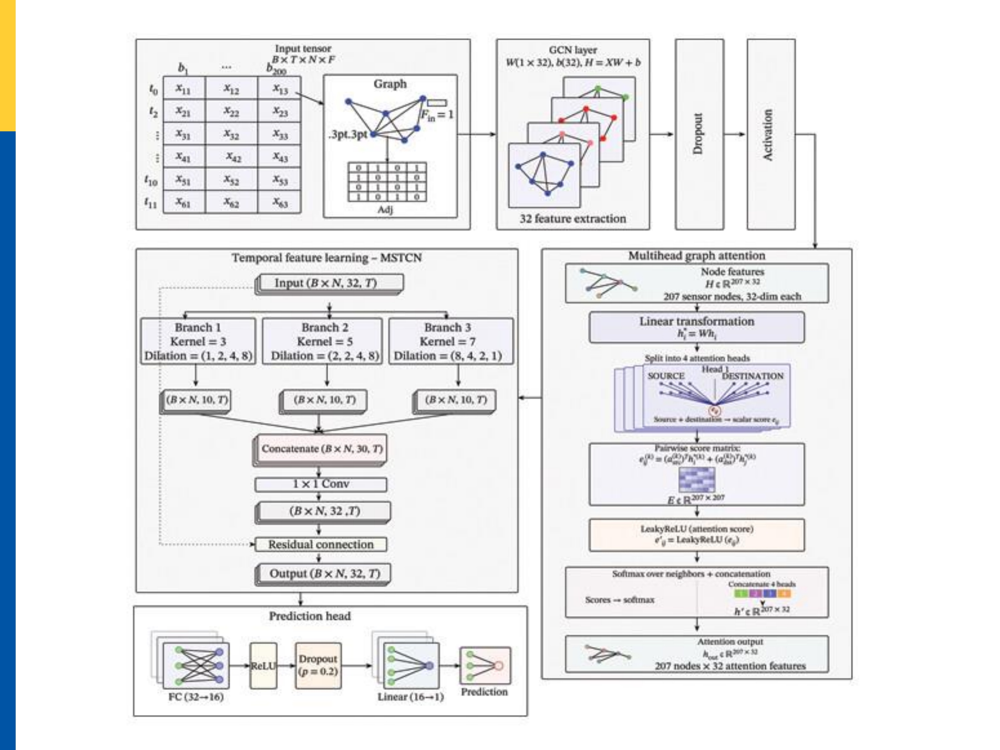
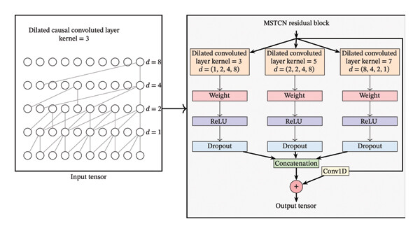
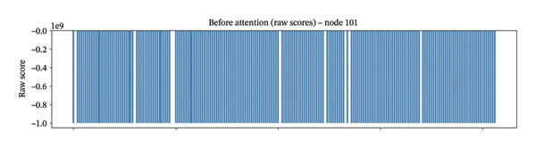
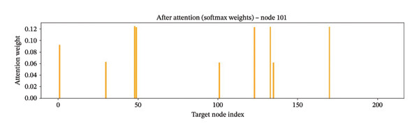
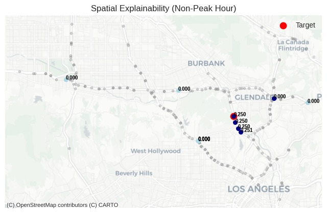
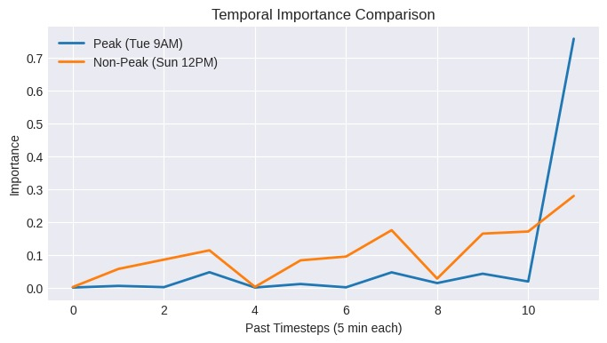

<div align="center">

### An Interpretable Graph Convolutional Network With Spatial Attention and Multiscale Temporal Convolutional Network for Real-Time Traffic Forecasting

[](https://doi.org/10.1155/acis/6841802)
[](https://doi.org/10.1155/acis/6841802)
[](https://creativecommons.org/licenses/by/4.0/)
[](https://www.python.org/)
[](https://pytorch.org/)
[](LICENSE)

**Mina Akter · Nuzhat Farhan · Siema · Md. Khaliluzzaman**

Computational Intelligence Lab (CILab)
Department of Computer Science and Engineering
International Islamic University Chittagong (IIUC), Bangladesh

[Paper](https://doi.org/10.1155/acis/6841802) · [Dataset](https://zenodo.org/records/5724362)

</div>

---

## Overview

This repository contains the PyTorch implementation of **GCN-Attn-MSTCN**, an interpretable deep learning framework for real-time traffic forecasting.

The model combines:

* **Graph Convolutional Network (GCN)** for learning spatial dependencies between traffic sensors.
* **Multi-head spatial attention** for adaptively identifying influential neighboring sensors.
* **Multiscale Temporal Convolutional Network (MSTCN)** for learning short-, medium-, and long-term temporal dependencies.
* **Gradient-based temporal attribution** for analyzing the importance of historical observations.
* **Spatiotemporal importance analysis** for jointly examining spatial and temporal contributions.

The model is evaluated on the **METR-LA** and **PEMS-BAY** traffic forecasting benchmarks for 15-, 30-, 45-, and 60-minute forecasting horizons.

The corresponding research article was published in **Applied Computational Intelligence and Soft Computing** in 2026.

**Paper:**
https://doi.org/10.1155/acis/6841802

---

## Abstract

Accurate traffic forecasting is a crucial task for intelligent transportation systems (ITS), but it is challenging to capture the complex spatial and temporal dependencies in traffic data.

This work proposes **GCN-Attn-MSTCN**, a hybrid framework that combines graph convolution, spatial attention, and multiscale temporal convolution for multi-horizon traffic forecasting.

The GCN captures spatial correlations among road sensors, while the spatial attention mechanism adaptively emphasizes influential neighboring sensors. The MSTCN uses multiscale dilated causal convolutions to model temporal dependencies across different time scales while preserving temporal causality.

The proposed framework is evaluated on the benchmark **METR-LA** and **PEMS-BAY** datasets for 15-, 30-, 45-, and 60-minute forecasting horizons. The model achieves competitive performance against representative traffic forecasting methods while providing interpretable spatial and temporal insights.

On METR-LA, GCN-Attn-MSTCN achieves:

| Horizon |      MAE |     RMSE |      MAPE |
| ------- | -------: | -------: | --------: |
| 15 min  | **2.71** | **5.08** | **6.75%** |
| 30 min  | **3.01** | **6.05** | **8.02%** |
| 45 min  | **3.24** | **6.63** | **8.87%** |
| 60 min  | **3.43** | **7.10** | **9.62%** |

The model also provides interpretable insights through spatial attention visualization, gradient-based temporal attribution, and combined spatiotemporal importance analysis.

---

# Key Contributions

### 1. Spatial Representation Learning

A graph convolutional layer models the spatial relationships between traffic sensors using a predefined road-network graph.

### 2. Adaptive Spatial Attention

A multi-head graph attention mechanism learns which neighboring sensors are most influential for a target sensor.

### 3. Multiscale Temporal Modeling

The MSTCN uses causal dilated convolutions with multiple kernel sizes and dilation patterns to capture temporal dependencies at different scales.

### 4. Multi-Horizon Forecasting

A single model jointly predicts the next 12 time steps, corresponding to 15-, 30-, 45-, and 60-minute forecasting horizons.

### 5. Model Interpretability

The framework provides:

* Spatial attention visualization
* Peak vs. non-peak spatial analysis
* Gradient-based temporal attribution
* Combined spatiotemporal importance maps

---

# Architecture

The overall GCN-Attn-MSTCN framework consists of four major stages:

**Input → GCN → Spatial Attention → MSTCN → Prediction Head**

<p align="center">
  
</p>

<p align="center">
  <em>Overall architecture of the proposed GCN-Attn-MSTCN framework.</em>
</p>

---

## Model Components

| Stage    | Module                 | Description                                        |
| -------- | ---------------------- | -------------------------------------------------- |
| Input    | Traffic sequence       | 12 historical time steps for all sensors           |
| Spatial  | GCN                    | Learns local spatial dependencies                  |
| Spatial  | Multi-head attention   | Assigns adaptive importance to neighboring sensors |
| Temporal | MSTCN                  | Captures multiscale temporal dependencies          |
| Head     | Fully connected layers | Produces multi-step traffic forecasts              |

---

## Input Representation

The model receives a sequence of traffic observations:

```text
(B, T, N, F)
```

where:

* `B` = batch size
* `T` = 12 historical time steps
* `N` = number of traffic sensors
* `F` = input feature dimension

For the primary experiments:

```text
METR-LA:  N = 207
PEMS-BAY: N = 325
T = 12
F = 1
```

The 12 historical observations correspond to **one hour of traffic history**, because each observation is sampled every five minutes.

---

# Spatial Modeling

## Graph Convolution

The predefined sensor graph is used to capture spatial dependencies between traffic sensors.

The normalized adjacency matrix is defined as:

```text
à = D^(-1/2) (A + I) D^(-1/2)
```

where:

* `A` is the sensor adjacency matrix.
* `I` is the identity matrix representing self-connections.
* `D` is the corresponding degree matrix.

The GCN first produces spatially enriched sensor representations.

---

## Multi-Head Spatial Attention

Following graph convolution, the model applies a multi-head spatial attention mechanism.

The attention mechanism is restricted to graph-connected neighbors rather than allowing every sensor to attend to every other sensor.

The model uses:

* 4 attention heads
* LeakyReLU attention scores
* Graph-neighborhood masking
* Softmax temperature `T = 0.5`
* Residual connection
* Layer normalization

This allows the model to learn which neighboring sensors contribute most strongly to the prediction of a target sensor.

---

# Temporal Modeling

## Multiscale Temporal Convolutional Network

The temporal module consists of three stacked MSTCN blocks.

Each block contains parallel causal dilated convolution branches with different kernel sizes.

The model uses:

```text
Kernel sizes:
3, 5, 7
```

with the following dilation configurations:

```text
Block 1: (1, 2, 4, 8)
Block 2: (2, 2, 4, 8)
Block 3: (8, 4, 2, 1)
```

The outputs of the temporal branches are fused using a `1 × 1` convolution.

The architecture also uses residual connections, normalization, ReLU activation, and dropout.

<p align="center">
  
</p>

<p align="center">
  <em>Multiscale temporal convolutional block with causal dilated convolutions.</em>
</p>

---

# Prediction Head

The final temporal representation is passed through a fully connected prediction head:

```text
32 → 16 → 12
```

with:

* ReLU activation
* Dropout
* Linear output layer

The model predicts all 12 future time steps jointly.

The reported horizons are:

| Forecasting step |    Horizon |
| ---------------: | ---------: |
|                3 | 15 minutes |
|                6 | 30 minutes |
|                9 | 45 minutes |
|               12 | 60 minutes |

---

# Datasets

The model is evaluated on two widely used traffic forecasting benchmarks.

## METR-LA

| Property          | Value              |
| ----------------- | ------------------ |
| Region            | Los Angeles County |
| Sensors           | 207                |
| Sampling interval | 5 minutes          |
| Input length      | 12                 |
| Forecast length   | 12                 |

## PEMS-BAY

| Property          | Value                  |
| ----------------- | ---------------------- |
| Region            | San Francisco Bay Area |
| Sensors           | 325                    |
| Sampling interval | 5 minutes              |
| Input length      | 12                     |
| Forecast length   | 12                     |

The datasets are publicly available through the traffic forecasting research community.

**Dataset source:**
https://zenodo.org/records/5724362

---

# Experimental Protocol

The datasets are divided chronologically into:

```text
70% Training
10% Validation
20% Testing
```

### Data preprocessing

* StandardScaler is fitted using the **training split only**.
* The same scaler is applied to validation and test data.
* Evaluation metrics are reported on the original traffic-speed scale.
* Zero-valued readings are treated as missing values and excluded from masked metrics.

### Evaluation metrics

The following metrics are used:

* Mean Absolute Error (MAE)
* Root Mean Squared Error (RMSE)
* Mean Absolute Percentage Error (MAPE)
* Coefficient of Determination (R²)

---

# Results

## METR-LA

The proposed model achieves the following performance:

| Horizon |     RMSE |      MAE | MAPE (%) |         R² |
| ------- | -------: | -------: | -------: | ---------: |
| 15 min  | **5.08** | **2.71** | **6.75** | **0.8480** |
| 30 min  | **6.05** | **3.01** | **8.02** | **0.8030** |
| 45 min  | **6.63** | **3.24** | **8.87** | **0.7660** |
| 60 min  | **7.10** | **3.43** | **9.62** | **0.7240** |


## PEMS-BAY

| Horizon |     RMSE |      MAE | MAPE (%) |         R² |
| ------- | -------: | -------: | -------: | ---------: |
| 15 min  | **2.92** | **1.38** | **2.84** | **0.8320** |
| 30 min  | **3.41** | **1.61** | **3.31** | **0.7950** |
| 45 min  | **3.82** | **1.82** | **3.74** | **0.7510** |
| 60 min  | **4.16** | **2.00** | **4.08** | **0.7180** |

---

# Comparison with Existing Methods

The proposed model is compared with representative traffic forecasting architectures on METR-LA.

| Model              | 15-min MAE / RMSE / MAPE | 30-min MAE / RMSE / MAPE | 60-min MAE / RMSE / MAPE |
| ------------------ | ------------------------ | ------------------------ | ------------------------ |
| FC-LSTM            | 3.44 / 6.30 / 9.60       | 3.77 / 7.23 / 10.90      | 4.37 / 8.69 / 13.20      |
| DCRNN              | 2.77 / 5.38 / 7.30       | 3.15 / 6.45 / 8.80       | 3.60 / 7.60 / 10.50      |
| GGRU               | 2.71 / 5.24 / 6.99       | 3.12 / 6.36 / 8.56       | 3.64 / 7.65 / 10.62      |
| STGCN              | 2.88 / 5.74 / 7.62       | 3.47 / 7.24 / 9.57       | 4.59 / 9.40 / 12.70      |
| ASTGCN             | 4.86 / 9.27 / 9.21       | 5.43 / 10.61 / 10.13     | 6.51 / 12.52 / 11.64     |
| Graph WaveNet      | 2.69 / 5.15 / 6.90       | 3.07 / 6.22 / 8.37       | 3.53 / 7.37 / 10.01      |
| AGCRN              | 2.87 / 5.58 / 7.70       | 3.22 / 6.68 / 8.94       | 3.94 / 8.02 / 11.06      |
| MTGNN              | 2.69 / 5.18 / 6.86       | 3.05 / 6.17 / 8.19       | 3.49 / 7.23 / 9.87       |
| GMAN               | 2.80 / 5.55 / 7.41       | 3.18 / 6.63 / 8.73       | 3.92 / 8.02 / 10.53      |
| **GCN-Attn-MSTCN** | **2.71 / 5.08 / 6.75**   | **3.01 / 6.05 / 8.02**   | **3.43 / 7.10 / 9.62**   |

At 15 minutes, Graph WaveNet and MTGNN achieve slightly lower MAE values. However, GCN-Attn-MSTCN achieves the lowest RMSE and MAPE at this horizon and provides competitive or better performance at longer forecasting horizons.

---

# Ablation Study

The contribution of the major architectural components is evaluated through ablation experiments on METR-LA.

| Model              | GCN | TCN | MS-TCN | Spatial Attention |     RMSE |      MAE | MAPE (%) |         R² |
| ------------------ | :-: | :-: | :----: | :---------------: | -------: | -------: | -------: | ---------: |
| A                  |  ✓  |  ✓  |        |                   |     5.58 |     2.95 |     7.34 |     0.7340 |
| B                  |  ✓  |  ✓  |        |         ✓         |     5.33 |     2.86 |     7.08 |     0.7820 |
| C                  |  ✓  |     |    ✓   |                   |     5.46 |     2.90 |     7.22 |     0.7634 |
| **D — Full model** |  ✓  |     |    ✓   |         ✓         | **5.08** | **2.71** | **6.75** | **0.8480** |

The ablation results demonstrate that the spatial attention mechanism and multiscale temporal modeling provide complementary improvements over the simpler architectures.

---

# Cross-Dataset Generalization

To evaluate generalization across traffic networks, cross-dataset experiments are also performed.

| Train → Test       | RMSE |  MAE | MAPE (%) |     R² |
| ------------------ | ---: | ---: | -------: | -----: |
| METR-LA → PEMS-BAY | 3.74 | 1.79 |     2.97 | 0.8205 |
| PEMS-BAY → METR-LA | 5.48 | 2.89 |     7.12 | 0.7839 |

For the METR-LA → PEMS-BAY setting, a 207-sensor subset is used to match the graph size of METR-LA.

---

# Computational Efficiency

The computational cost of the major model variants is summarized below.

| Model              | Parameters (M) |  FLOPs (G) | Latency B=1 (ms) | Latency B=64 (ms) |
| ------------------ | -------------: | ---------: | ---------------: | ----------------: |
| GCN-TCN            |          0.020 |     12.805 |      2.92 ± 0.18 |      33.95 ± 0.39 |
| GCN-Attn-TCN       |          0.021 |     13.314 |      9.85 ± 0.32 |      79.55 ± 0.51 |
| **GCN-Attn-MSTCN** |      **0.020** | **29.218** | **13.50 ± 1.23** | **137.99 ± 1.18** |

Additional throughput and GPU memory measurements are reported in the paper.

---

# Interpretability

One of the main objectives of GCN-Attn-MSTCN is to provide interpretable information about the spatial and temporal factors influencing traffic predictions.

The repository includes analysis of:

1. Spatial attention
2. Peak vs. non-peak spatial attention
3. Gradient-based temporal importance
4. Combined spatiotemporal importance

---

## 1. Spatial Attention

The learned attention coefficients indicate which neighboring sensors contribute most strongly to a target sensor's representation.

For each target sensor, the attention mechanism produces importance scores for its graph-connected neighbors.

The attention analysis can be visualized before and after softmax normalization.

<p align="center">
  
  
</p>

<p align="center">
  <em>Raw attention scores and normalized spatial attention weights for a target sensor.</em>
</p>

---

## 2. Peak vs. Non-Peak Spatial Attention

The model's spatial attention is also examined under different traffic conditions.

During peak traffic periods, the attention mechanism tends to concentrate on a smaller number of influential neighboring sensors. During non-peak periods, the attention distribution can become more dispersed.

<p align="center">
  
</p>
<p align="center">
  
</p>


<p align="center">
  <em>Spatial attention patterns under peak and non-peak traffic conditions.</em>
</p>

---

## 3. Gradient-Based Temporal Attribution

Instead of assuming that the MSTCN contains a temporal attention mechanism, temporal importance is estimated using gradients.

For a target prediction:

```text
Temporal importance = |∂ŷ / ∂x|
```

This measures the sensitivity of the prediction to the historical input sequence.

The analysis helps identify which historical time steps have the greatest influence on the prediction.

<p align="center">
  
</p>

<p align="center">
  <em>Gradient-based temporal importance for peak and non-peak traffic conditions.</em>
</p>


# Training Configuration

The main training configuration uses:

| Parameter             | Value  |
| --------------------- | ------ |
| Optimizer             | Adam   |
| Learning rate         | `1e-3` |
| Weight decay          | `1e-5` |
| Batch size            | 64     |
| Epochs                | 50     |
| GCN hidden dimension  | 32     |
| Attention heads       | 4      |
| Attention temperature | 0.5    |
| Temporal dropout      | 0.2    |
| Forecast horizon      | 12     |
| Input sequence length | 12     |

A validation-based learning-rate scheduler is used during training.

---


# Data Preparation

Download the METR-LA and PEMS-BAY datasets from the original/public dataset source:

https://zenodo.org/records/5724362

# Publication

This repository accompanies the following publication:

**Mina Akter, Nuzhat Farhan, Siema, and Md. Khaliluzzaman.**

> **An Interpretable Graph Convolutional Network With Spatial Attention and Multiscale Temporal Convolutional Network for Real-Time Traffic Forecasting.**

*Applied Computational Intelligence and Soft Computing*, 2026.

**Article ID:** 6841802

**DOI:** https://doi.org/10.1155/acis/6841802

[📄 Read the published paper](https://doi.org/10.1155/acis/6841802)

---

# Citation

If you use this work, please cite:

```bibtex
@article{akter2026interpretable,
  title     = {An Interpretable Graph Convolutional Network With Spatial Attention and Multiscale Temporal Convolutional Network for Real-Time Traffic Forecasting},
  author    = {Akter, Mina and Farhan, Nuzhat and Siema and Khaliluzzaman, Md.},
  journal   = {Applied Computational Intelligence and Soft Computing},
  volume    = {2026},
  pages     = {6841802},
  year      = {2026},
  publisher = {Wiley},
  doi       = {10.1155/acis/6841802}
}
```

---

# Acknowledgements

The authors acknowledge the publicly available **METR-LA** and **PEMS-BAY** traffic forecasting datasets used in this research.

The datasets were originally introduced in the traffic forecasting literature and are distributed through public repositories.

The research was conducted at the **Computational Intelligence Lab (CILab), Department of Computer Science and Engineering, International Islamic University Chittagong (IIUC), Bangladesh**.


<div align="center">

**GCN-Attn-MSTCN — Interpretable Traffic Forecasting with Graph and Multiscale Temporal Learning**

</div>
